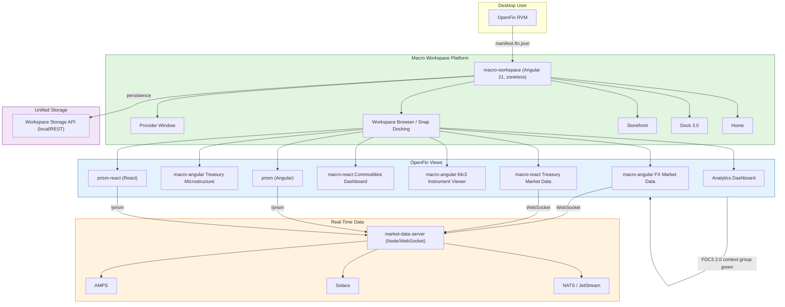
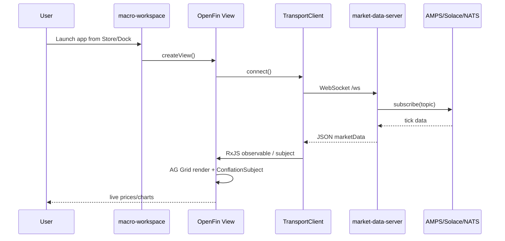

# Macro Desktop MFE — Architecture Overview

> Generated by the codebase. This diagram is a rendered Mermaid diagram; use the diagram or the `%%{init}...%%` block in any Mermaid renderer.

## System Context



## Monorepo Layout

```mermaid
graph LR
  subgraph apps["apps/"]
    A[macro-angular<br/>4200]
    B[macro-react<br/>4201]
    C[macro-workspace<br/>4202]
    D[macro-angular-fdc3<br/>4203]
    E[prism<br/>4204]
    F[prism-react<br/>4205]
    G[capital-markets-themes<br/>4206]
    H[market-data-server<br/>3000]
    I[macro-mcp / macro-mcp-agent]
  end

  subgraph libs["libs/"]
    L1[@macro/openfin]
    L2[@macro/transports]
    L3[@macro/macro-design]
    L4[@macro/macro-angular-grid]
    L5[@macro/macro-react-grid]
    L6[@macro/macro-grid-format]
    L7[@macro/prism-core]
    L8[@macro/utils]
    L9[@macro/logger]
    L10[@macro/mcp-core]
  end

  A --> L4
  B --> L5
  A & B & C & D & E & F & G --> L3
  A & B & C & D & E & F --> L2
  A & B & C & D & E & F --> L1
  E & F --> L7
  L4 & L5 --> L6
  L2 & L4 & L5 & L7 --> L8
  L1 & L2 & L3 --> L9
  I --> L10

  style apps fill:#e1f5e1,stroke:#2e7d32
  style libs fill:#e3f2fd,stroke:#1565c0
```

## Shared Library Dependencies

```mermaid
flowchart TB
  subgraph SharedLibraries["Shared Libraries"]
    Transports[@macro/transports]
    OpenFin[@macro/openfin]
    Design[@macro/macro-design]
    Logger[@macro/logger]
    AngularGrid[@macro/macro-angular-grid]
    ReactGrid[@macro/macro-react-grid]
    GridFormat[@macro/macro-grid-format]
    PrismCore[@macro/prism-core]
    Utils[@macro/utils]
    McpCore[@macro/mcp-core]
  end

  AngularApps["Angular Apps"]
  ReactApps["React Apps"]
  Workspace["macro-workspace"]
  Server["market-data-server"]
  McpServers["macro-mcp / macro-mcp-agent"]

  AngularApps -->|uses| AngularGrid
  ReactApps -->|uses| ReactGrid
  AngularGrid -->|wraps| GridFormat
  ReactGrid -->|wraps| GridFormat
  PrismCore -->|uses| Transports
  AngularApps & ReactApps & Workspace -->|subscribe| Transports
  AngularApps & ReactApps & Workspace -->|FDC3 / platform| OpenFin
  AllApps["All Apps"] -->|theme + tokens| Design
  AllApps -->|logging| Logger
  Transports -->|conflation| Utils
  OpenFin -->|theme config| Design
  McpServers -->|tools/resources| McpCore
  Server -->|workspace storage| OpenFin

  style SharedLibraries fill:#e3f2fd,stroke:#1565c0
  style AllApps fill:#e1f5e1,stroke:#2e7d32
```

## Data Flow



## Key Conventions

- **Path aliases**: All shared code is imported via `@macro/*` from `tsconfig.base.json`.
- **Theming**: `@macro/macro-design` owns CSS variables, dark mode, and AG Grid theme.
- **Transports**: One `TransportClient` interface for AMPS, Solace, NATS, and NATS JetStream.
- **OpenFin**: `@macro/openfin` wraps Workspace, Browser, Dock, Storefront, Notifications, Context, and unified storage.
- **FDC3**: All views run on `currentContextGroup: "green"`.
- **Storage**: `WorkspaceStorageClient` handles localStorage or per-environment REST (phase-1 in `market-data-server` at `/workspace/v1`).
- **MCP**: `@macro/mcp-core` is shared by `macro-mcp` (stdio) and `macro-mcp-agent` (HTTP/SSE) for scaffolding, Figma import, and AMPS exploration.

## Useful Commands

```bash
npm start           # workspace + angular + react + fdc3
npm run launch      # OpenFin RVM with local manifest
npm run start:prism # prism blotter
npm run start:market-data-server
```
